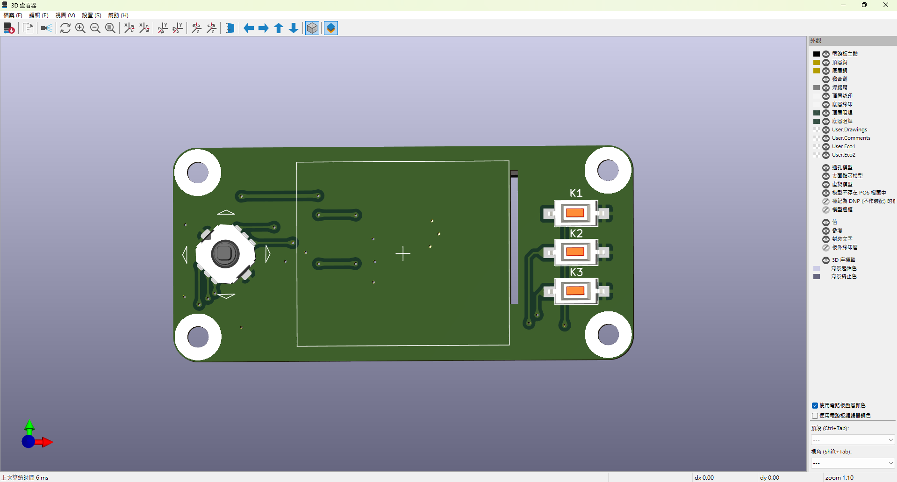
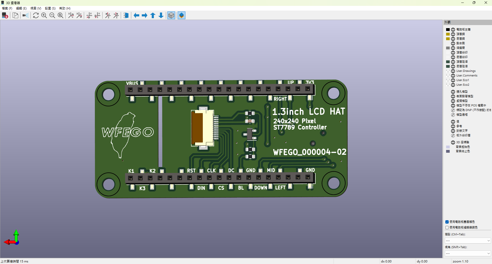
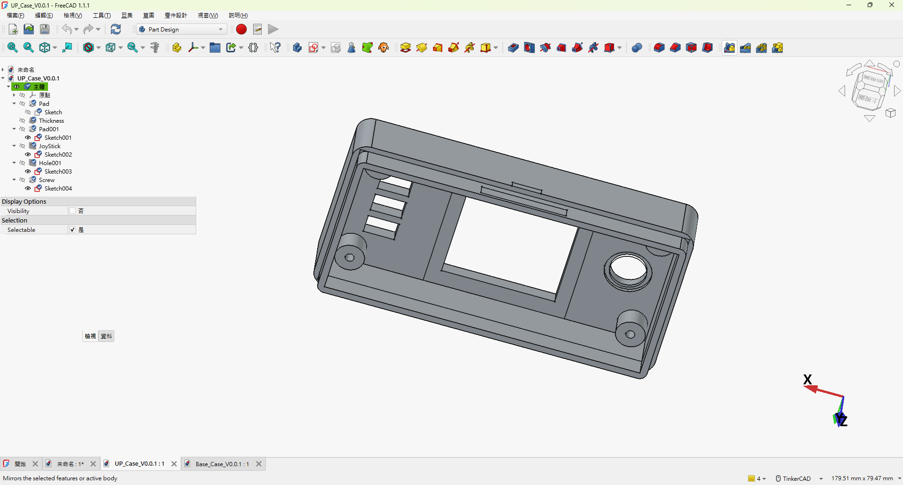
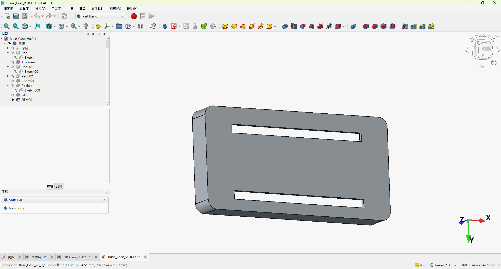
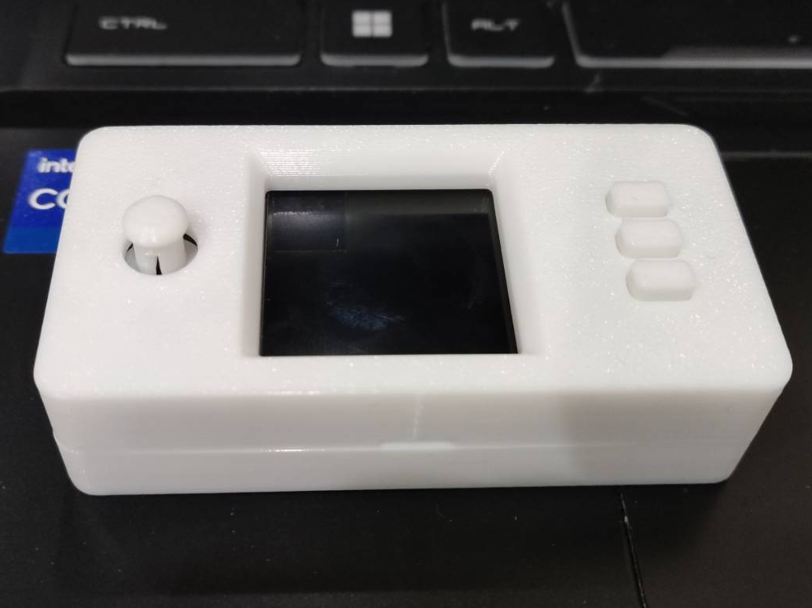
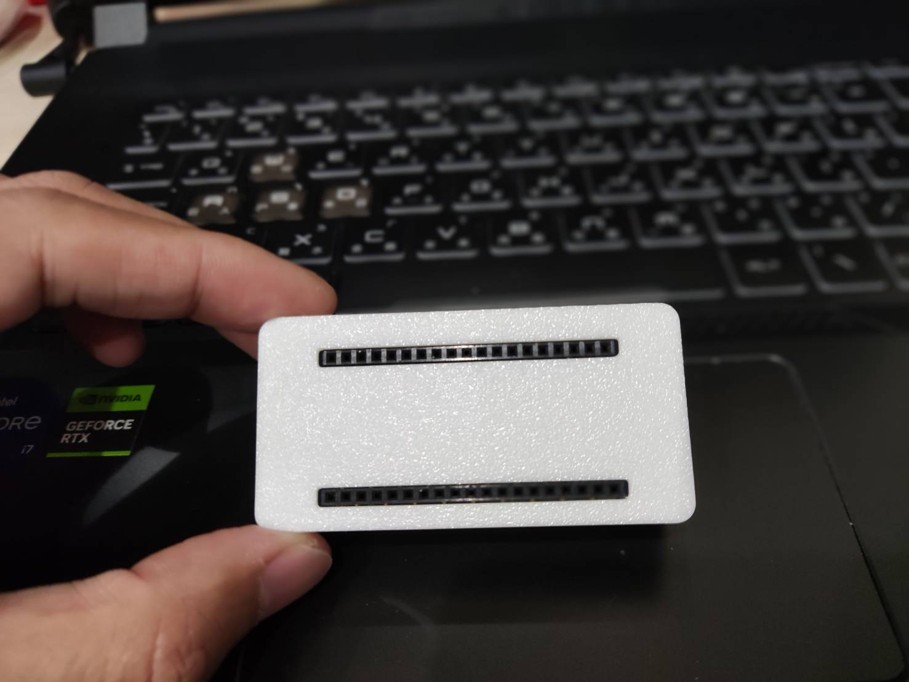

# 1.3 吋 顯示模組與客製化外殼開發   

## 專案描述   
* 獨立開發 1.3 吋 顯示模組之嵌入式展示平台，包含顯示模組整合、機構外殼設計與實體原型製作，提升模組於 IoT / Embedded Prototype 專案中的安裝便利性與產品完整度。   

## 負責內容   
* 整合 1.3 吋 顯示模組與嵌入式硬體平台.   

* 使用 FreeCAD 工具進行外殼與固定結構設計   

* 依據實際 PCB 尺寸進行機構公差與開孔調整   
* 使用 3D Printer 完成外殼打樣與組裝驗證   

* 優化模組固定性、組裝效率與外觀一致性   
* 建立展示影片與 MakerWorld 專案頁面進行成果展示   
  * [demo 影片](https://www.youtube.com/watch?v=j0WRlITiKVU)   
  * [MakerWorld](https://makerworld.com/zh/models/2195241-wfego-000004-1-3-inch-display#profileId-2383919)   

## 技術重點   
* Embedded Hardware Integration   
* Display Module   
* Mechanical Enclosure Design   
* Rapid Prototyping   
* 3D Printing   
* Hardware Prototype Validation   

## 專案成果   
* 完成可實際應用之 OLED 顯示模組外殼原型   
* 建立完整實體展示與產品化概念驗證   
* 展現嵌入式硬體整合與機構協同設計能力.    
