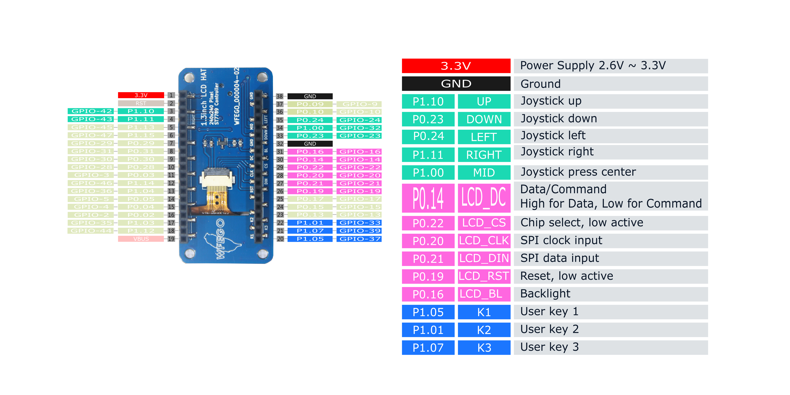
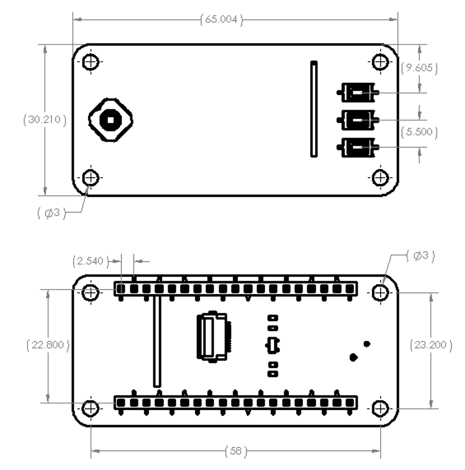

# WFEGO_000004 介紹

## The Pinout of the WFEGO_000004-02

### Joystick 資訊
* Joystick UP : P1.10，對應GPIO Number為 **42**.
* Joystick DOWN : P0.23，對應GPIO Number為 **23**.
* Joystick LEFT : P0.24，對應GPIO Number為 **24**.
* Joystick RIGHT : P1.11，對應GPIO Number為 **43**.
* Joystick MID : P1.00，對應GPIO Number為 **32**.

### LCD Control 資訊
* LCD_DC : P0.14，對應GPIO Number為 **14**.
  * Hight for Data, Low for Command.
* LCD_CS : P0.22，對應GPIO Number為 **22**.
  * Chip select, low active.
* LCD_CLK : P0.20，對應GPIO Number為 **20**.
  * SPI clock input.
* LCD_DIN : P0.21，對應GPIO Number為 **21**.
  * SPI data input.
* LCD_RST : P0.19，對應GPIO Number為 **19**.
  * Reset, low active.
* LCD_BL : P0.16，對應GPIO Number為 **16**.
  * **LCD_BL PIN High = Enable (LCD Backlight On)**

### User key 資訊
* K1 : P1.05，對應GPIO Number為 **37**.
* K2 : P1.01，對應GPIO Number為 **33**.
* K3 : P1.07，對應GPIO Number為 **39**.

## Dimensions

## [教學](./Tutorial/Tutorial.md)

## [Buy From](https://shopee.tw/ST7789-1.3%E5%90%8B-240-x-240-%E8%BF%B7%E4%BD%A065K%E5%85%A8%E5%BD%A9-IPS%E6%B6%B2%E6%99%B6%E8%9E%A2%E5%B9%95-SPI%E9%80%9A%E8%A8%8A-LCD%E9%A1%AF%E7%A4%BA%E5%99%A8-i.26640381.28901773952?xptdk=ba4e6fc9-07b9-4d0c-a5a3-281ecef229f6)